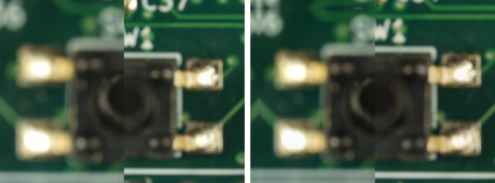
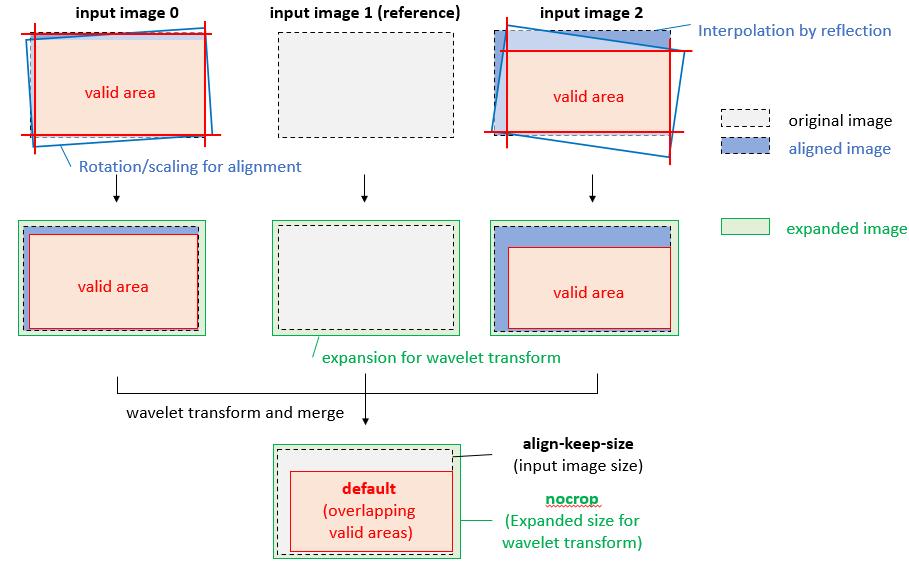
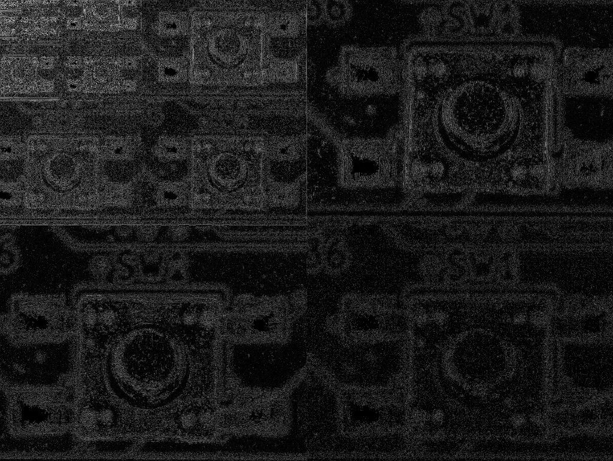
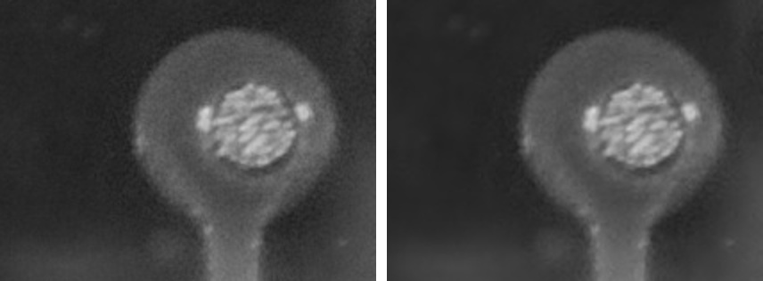
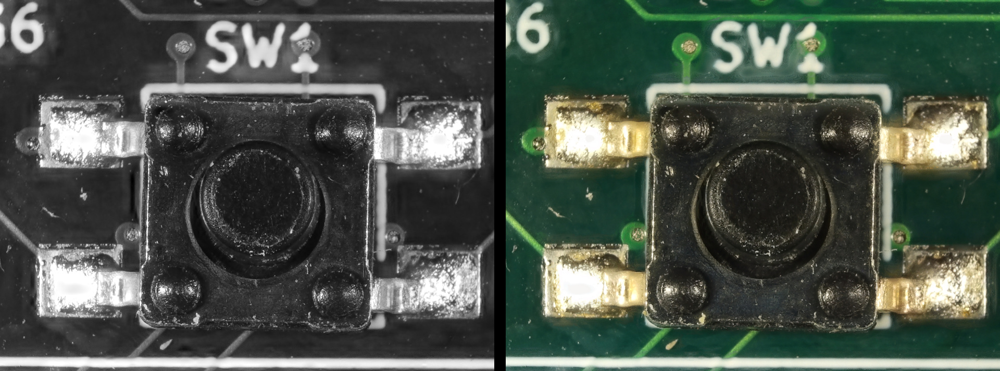
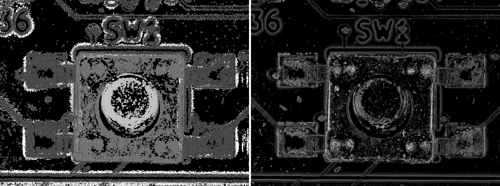
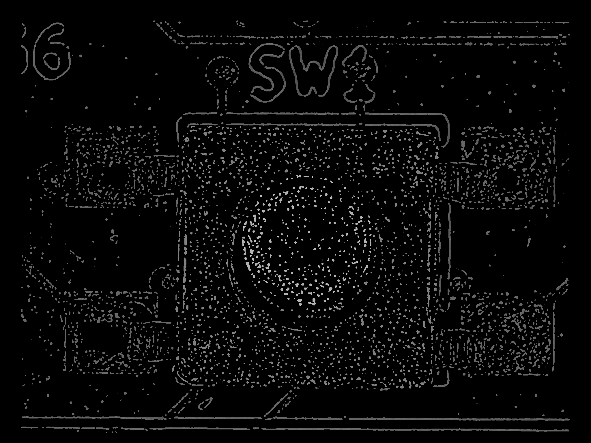
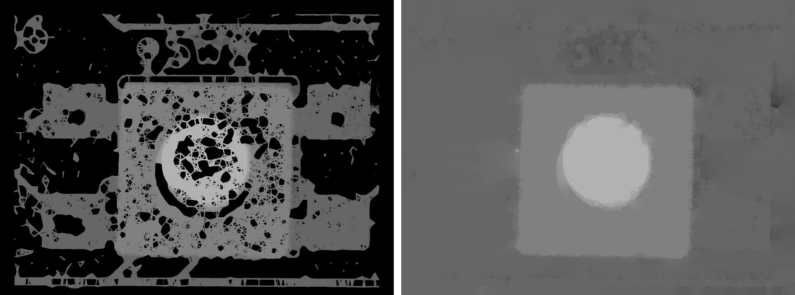
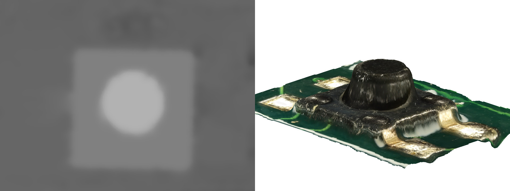

Description of focus-stack algorithms
=====================================

This document explains the inner functioning of `focus-stack` and shows intermediate images generated from the `examples/depthmap` set.
The command line switch `--save-steps` enables saving of the debug image files.

Image alignment
---------------
Image alignment in [Task_Align](../src/task_align.cc) step corrects for differences between adjancent images in stack:

* Different scale due to focus lens movement.
* Different center position and rotation due to camera movement or optical center misalignment
* Different exposure and white balance due to camera autoexposure algorithms

The algorithm used for geometric alignment is OpenCV [findTransformECC](https://docs.opencv.org/3.4/dc/d6b/group__video__track.html#ga1aa357007eaec11e9ed03500ecbcbe47).
After initial aligment of low resolution images, the exposure and white balance are matched by sampling a few thousand pixels of the image and calculating a least squares fit.
Finally a high resolution geometric alignment is calculated on the exposure corrected images.

In a deep stack the extreme images are often very blurry and cannot be successfully aligned to the center of the stack.
The default approach is therefore to align each image against its neighbour and combine the alignment coefficients to get to the reference image. This behavior can be changed with the `--global-align` command line flag.

Input images need to be expanded both to accommodate rotation for alignment,
and to match the wavelet transform block size. The added borders are normally
cropped from the output, which can be controlled with options `--nocrop` and
`--align-keep-size`.

Grayscale conversion
--------------------
The main processing algorithms run in grayscale space.
[Task_Grayscale](../src/task_grayscale.cc) uses [PCA](https://en.wikipedia.org/wiki/Principal_component_analysis) to determine the combination of color channels with largest variance.
This maximizes the amount of information that can be captured to the grayscale version.

Complex wavelet transform
-------------------------
The image merge algorithm relies on complex [wavelet](https://en.wikipedia.org/wiki/Wavelet_transform) representation of the grayscale images.
[Task_Wavelet](../src/task_wavelet.cc) separates the image to frequency layers, with the lower frequencies represented using progressively smaller versions of the image.

Grayscale input images are converted to wavelets and merged in batches.
Result image is then converted back from complex wavelets to a grayscale image.

Merge algorithm
---------------
The merge algorithm in [Task_Merge](../src/task_merge.cc) is described in [Complex Wavelets for Extended Depth-of-Field: A New Method for the Fusion of Multichannel Microscopy Images](http://bigwww.epfl.ch/publications/forster0404.html) by B. Forster, D. Van De Ville, J. Berent, D. Sage and M. Unser.

At each position of the wavelet image, the largest absolute value pixel from the stack is selected.
Further filtering is performed to select the majority pixel among spatial neighbours and among horizontal/vertical/diagonal subbands.

Denoise
-------
Wavelet denoising algorithm in [Task_Denoise](../src/task_denoise.cc) works by thresholding and scaling the wavelet values.
This has the effect of removing small changes while preserving large sharp contrasts.

Color reassignment
------------------
To obtain color output image, [Task_Reassign](../src/task_reassign.cc) selects a colored pixel from the stack that best matches the grayscale value obtained from the merge algorithm.
This has the effect that all output pixels are of a value that actually exists in at least one stack image, avoiding artefacts from color interpolation.
Computing merged image for only a single channel also reduces memory usage and computational effort.

Currently the merge algorithm has some trouble with halo effects, where the blurred version of a high-contrast feature is selected at a position that should otherwise have flat color.
The color reassignment tends to make these artefacts more visible, as there isn't a good match for the blurred color at that pixel position.

The implementation progressively builds a color reassignment map to avoid having to store all input images during processing.
The map contains a compact representation of grayscale values and matching color values that have been seen in input images.
This reduces memory usage because multiple input images often have same pixel color, which then only has to be stored once.

Focus measure and depth map algorithm
-------------------------------------
Focus-stack has also a depthmap feature.
The depthmap algorithm is still in development, but currently it uses a [Sobel operator](https://en.wikipedia.org/wiki/Sobel_operator) based focus measure estimate.
[Task_FocusMeasure](../src/task_focusmeasure.cc) calculates a contrast estimate for each pixel in input images.

Depth map is then built in [Task_DepthMap](../src/task_depthmap.cc) by comparing the contrast of each image to its neighbors.
The idea is that sharp features change a lot even with small contrast changes.
In comparison already blurry features at defocused levels do not change much with further blurring.

The largest contrast change gives a preliminary depthmap and a map of the highest contrast change seen.
The depthmap also suffers from halo effects around high contrast areas.
These are removed by subtracting a [dilated](https://en.wikipedia.org/wiki/Dilation_(morphology)) version of the contrastmap from itself.
This has the effect of masking out any less sharp features around a sharp feature.

Halo removal gives a depthmap that only contains the highest contrast feature in each region.
The map is clean but sparse:

In some cases there remain outlier samples. These are eliminated before inpainting by calculating a low resolution depthmap and discarding points that deviate too much from it.

Two stages of [inpainting](https://en.wikipedia.org/wiki/Inpainting#Digital_Inpainting) are then performed by [Task_Depthmap_Inpaint](../src/task_depthmap_inpaint.cc).
Both of them are based on [RadialFilter](../src/radialfilter.cc) class, which filters image radially around each output pixel.

First stage of inpainting connects dots that have similar value and are close enough spatially.
Second stage fills in all remaining points by finding the first non-zero pixel in each radial direction and averaging them together.

Finally, the depthmap is smoothed using [bilateral filtering](https://en.wikipedia.org/wiki/Bilateral_filter) using Yuichi Takeda's [fast implementation](../src/fast_bilateral.hh).
This reduces remaining noise while preserving edges.
A simple built-in 3D renderer is used to generate preview images that combine the color and depth information.

